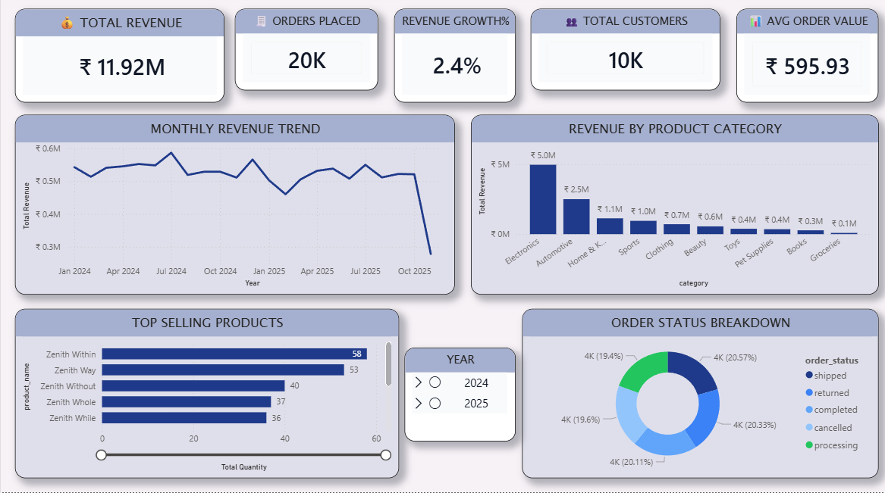
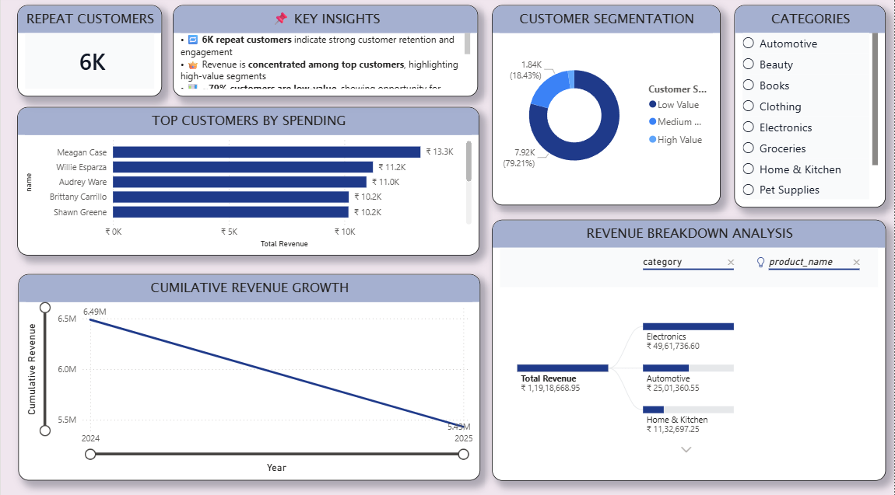

# 📊 ECOMMERCE SALES & CUSTOMER ANALYTICS PROJECT

## 🚀 PROJECT OVERVIEW

This project combines SQL and Power BI to analyze ecommerce sales performance, customer behavior, product trends, and business insights.  

The project includes:
- SQL database design and analysis
- Advanced SQL queries using joins and window functions
- Customer segmentation analysis
- Interactive Power BI dashboards
- Business insight generation for decision-making

The goal of this project is to demonstrate end-to-end data analytics workflow including data extraction, transformation, analysis, and visualization.

---

# 📌 BUSINESS OBJECTIVES

- Analyze overall ecommerce revenue and order performance
- Identify top-selling products and high-performing categories
- Understand customer purchasing behavior
- Track monthly revenue trends and growth
- Perform customer segmentation analysis
- Generate actionable business insights using SQL and Power BI

---

# 🛠 TOOLS & TECHNOLOGIES

- MySQL
- SQL
- Power BI
- DAX
- Data Modeling
- Window Functions
- Business Intelligence & Data Visualization

---

# 📂 PROJECT FILES

- `schema.sql` → Database schema creation
- `analysis_queries.sql` → Core business analysis queries
- `advanced_business_insights.sql` → Advanced SQL analysis
- `window_functions.sql` → SQL window function queries
- `ecommerce_dashboard.pbix` → Power BI dashboard
- `sales_overview.png` → Sales overview dashboard
- `customer_insights.png` → Customer insights dashboard
- `README.md` → Project documentation

---

# 📷 DASHBOARD PREVIEW

## ECOMMERCE SALES PERFORMANCE DASHBOARD

## CUSTOMER INSIGHTS & REVENUE ANALYSIS DASHBOARD

---

# 📊 KEY DASHBOARD FEATURES

## PAGE 1 — SALES PERFORMANCE OVERVIEW
- Total Revenue KPI
- Orders Placed KPI
- Revenue Growth %
- Total Customers KPI
- Average Order Value
- Monthly Revenue Trend
- Revenue by Product Category
- Top Selling Products
- Order Status Breakdown

## PAGE 2 — CUSTOMER & BUSINESS INSIGHTS
- Repeat Customers Analysis
- Customer Segmentation
- Top Customers by Spending
- Cumulative Revenue Growth
- Revenue Breakdown Analysis
- Interactive Category Filters
- Business Insight Summary

---

# 📈 KEY BUSINESS INSIGHTS

- Electronics category contributes the highest revenue
- Strong customer retention with a high number of repeat customers
- Revenue is concentrated among high-value customers
- Revenue trends show seasonal fluctuations across months
- Certain categories generate high revenue but lower profitability
- Customer segmentation helps identify high-value customer groups
- Order status analysis highlights operational performance patterns

---

# 🧠 SQL CONCEPTS USED

- INNER JOIN
- LEFT JOIN
- GROUP BY
- ORDER BY
- HAVING
- SUBQUERIES
- COMMON TABLE EXPRESSIONS (CTEs)
- WINDOW FUNCTIONS
- RANK()
- DENSE_RANK()
- ROW_NUMBER()
- AGGREGATE FUNCTIONS

---

# 📊 POWER BI FEATURES USED

- KPI Cards
- Interactive Filters & Slicers
- Bar Charts
- Line Charts
- Donut Charts
- Decomposition Tree
- Customer Segmentation Visuals
- DAX Measures
- Data Modeling

---

# 💡 PROJECT HIGHLIGHTS

- Built an end-to-end analytics project using SQL and Power BI
- Performed advanced SQL analysis for business insights
- Created interactive dashboards for data storytelling
- Implemented customer segmentation analysis
- Applied business intelligence techniques to ecommerce data

---

# ▶️ HOW TO USE

1. Download the SQL files and Power BI dashboard
2. Execute SQL scripts in MySQL Workbench
3. Open `.pbix` file in Power BI Desktop
4. Explore dashboard visuals and filters

---

# 👨‍💻 AUTHOR

## ADITHYA RANJITH
Data Analyst | SQL | Power BI | Python | Data Visualization
